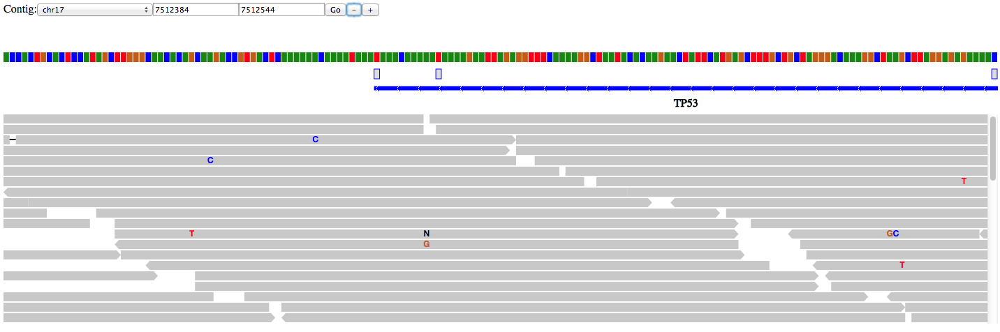

[](https://travis-ci.org/hammerlab/pileup.js) [](https://coveralls.io/r/hammerlab/pileup.js?branch=master) [](https://www.npmjs.org/package/pileup) [](https://david-dm.org/hammerlab/pileup.js) [](https://david-dm.org/hammerlab/pileup.js#info=devDependencies) [](https://zenodo.org/badge/latestdoi/8220/hammerlab/pileup.js)
 [](https://gitter.im/hammerlab/pileup.js?utm_source=badge&utm_medium=badge&utm_campaign=pr-badge)

# pileup.js
pileup.js is an interactive in-browser track viewer. [**Try a demo**][demo]!

It is built from the ground up to take advantage of the modern JavaScript
ecosystem, e.g. ES2015, static type analysis, React.js and Promises. Read more about the motivations behind pileup.js in our [paper][biorxiv].



Showing a structural variant (large deletion):


## Usage

To use pileup.js in a project, install it via NPM:

    npm install --save pileup

And then source either `node_modules/pileup/dist/pileup.min.js` or `pileup.js`.

To create a pileup, use `pileup.create()`. You specify a container DOM element,
an initial range and a list of tracks:

```javascript
var div = document.getElementById('your-id');
var p = pileup.create(div, {
  range: {contig: 'chr17', start: 7512384, stop: 7512544},
  tracks: [
    {
      viz: pileup.viz.genome(),
      isReference: true,
      data: pileup.formats.twoBit({
        url: 'http://www.biodalliance.org/datasets/hg19.2bit'
      }),
      name: 'Reference'
    },
    {
      viz: pileup.viz.pileup(),
      data: pileup.formats.bam({
        url: '/test-data/synth3.normal.17.7500000-7515000.bam',
        indexUrl: '/test-data/synth3.normal.17.7500000-7515000.bam.bai'
      }),
      cssClass: 'normal',
      name: 'Alignments'
    }
    // ...
  ]
});
```

Each track has a name, a data source and a visualization. See
[`/examples/playground.js`](/examples/playground.js) for a complete set of
track types.

To style the track viewer, use CSS! pileup.js uses [flexbox][] for track
layout. You can view [this codepen][layout] for a simple demo of the skeleton.
For example, to allocate 1/3 of the space to a variant track and 2/3 to a
pileup track, you could use this CSS:

```css
.track.variants { flex: 1; }
.track.pileup   { flex: 2; }
```

To style multiple tracks of the same type, you can use the `cssClass` property.

## API

The pileup object returned by `pileup.create` has these methods:

* `setRange`: Update the visible range in the pileup. This takes a
  `GenomeRange` object, e.g. `{contig: "chr17", start: 123, stop: 456}`. The
  coordinates are 1-based and the range is inclusive on both ends.
* `getRange`: Returns the currently-visible range. This is a `GenomeRange`
  object (see description in `setRange`).
* `destroy`: Tears down the pileup and releases references to allow proper
  garbage collection.

If you want to change the set of tracks in a pileup, tear it down and create a
new one. The caches are stored on the individual source and visualization
objects so, as long as you reuse these, the `destroy` / `create` cycle is
relatively cheap and will not incur extra trips to the network.

## Development

## Basic Setup

    git clone https://github.com/hammerlab/pileup.js.git
    cd pileup.js
    npm install
    npm run build

To play with the demo, start an [http-server][hs]:

    npm run http-server

Then open [http://localhost:8080/examples/index.html](http://localhost:8080/examples/index.html) in your browser of choice.

To view integration with GA4GH schemas, view [http://localhost:8080/examples/ga4gh-example.html](http://localhost:8080/examples/ga4gh-example.html).

## Testing

Run the tests from the command line:

    npm run test

Run the tests in a real browser:

    npm run http-server
    open http://localhost:8080/src/test/runner.html

To continuously regenerate the combined pileup and test JS, run:

    npm run watch

To run a single test from the command line, use:

    npm run test -- --grep=pileuputils

To do the same in the web UI, pass in a `?grep=` URL parameter.

To typecheck the code, run

    npm run flow

For best results, use one of the flowtype editor integrations.

## Design

See [DESIGN.md](/DESIGN.md).

If you're looking for ideas, see [ROADMAP.md](/ROADMAP.md)

## Releases

To cut a new release:

- Update `version` in both `package.json` and `pileup.js`. Commit this change.
- Run `scripts/publish.sh`
- Run `npm publish`
- Push to github and tag a release there. Add release notes.

## License

pileup.js is [Apache v2](/LICENSE) licensed.

[hs]: https://github.com/nodeapps/http-server
[layout]: http://codepen.io/anon/pen/VLzbBe?editors=110
[flexbox]: https://developer.mozilla.org/en-US/docs/Web/Guide/CSS/Flexible_boxes
[demo]: http://www.hammerlab.org/pileup/
[biorxiv]: http://biorxiv.org/content/early/2016/01/26/036962
